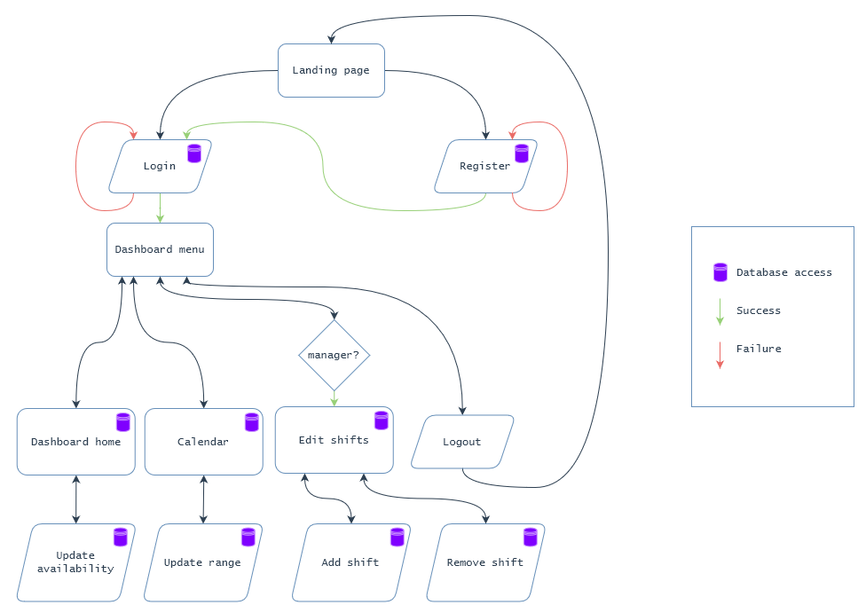

# EasyShift Final Report
Final report for CSCI 483. Written by Travis MacDonald and Prahar Ijner.

## Introduction

## Background

## Additional efforts by authors
In addition to concepts covered in the course, we researched and implemented the following to enhance the functionality and usability of EasyShift.

- Database implementation and connection
- Error handling
- Cascading style sheet
- Container management
- UI Components
  - DatePicker
  - Timeline
  - Card
  - Dialog
  - TabMenu
  - Ajax - partial rendering and processing

## Website design and workflow

### Home page (landing page)

### Login page

### Registration page

### Dashboard-menu
The dashboard menu, defined in `project/src/main/webapp/template/dashMenu.xhtml`, is the top bar seen by the user upon login. This consists of navigation links for the pages `dashboard.xhtml`, `calendar.xhtml`, `edit_events.xhtml`, and a logout button. The dashboard menu is defined as a template using the `ui:composition` from JSF-Facelets and included into each of the pages the user interacts with after logging in.
The dashboard's edit events button is a conditionally rendered element that is displayed only when the logged in user has manager level access.

### Dashboard home
The dashboard home, defined in `project/src/main/webapp/dashboard.xhtml`, is the first page the user sees after successfully logging into EasyShift. This interface displays the user's current company and the ID of their manager.

Additionally, the dashboard home displays the current availability of the user for each day of the week. The user is has the ability to add or remove availability on any of the days and submit these changes to the system. The system to edit availability is build with the following features
- Add or remove availability on any day: The user can indicate their abailability on any day of the week by setting hours when they are willing to be scheduled. This can include night shifts, part time abailability, and unabailability on any day(s).
- Add multiple availabilities on a single day: It is quite common for part-time workers to have multiple abailabilities in a given day, between which they have other engagements. The multiple abailability feature allows them to indicate all these times for easier and more efficient scheduling by the manager.
- Changes stay local until they are submitted: In order to avoid un-necessary update events on the database in cases where the user erroneously updated their availability, the changes are not submitted to the database until the user clicks the submit changes button.

### Dashboard calendar

### Dashboard edit-events

### Logout

### Styling
To ensure consistent design patterns and colors throughout the web pages, we defined a style sheet (see `project/src/main/webapp/styles.css`). This tool significantly aided us in improving the visual appeal of the application and setting parameters to distinguish calendar events, i.e., available and scheduled events.

### Database
{width=70% style="margin: auto;"}

## Future steps

