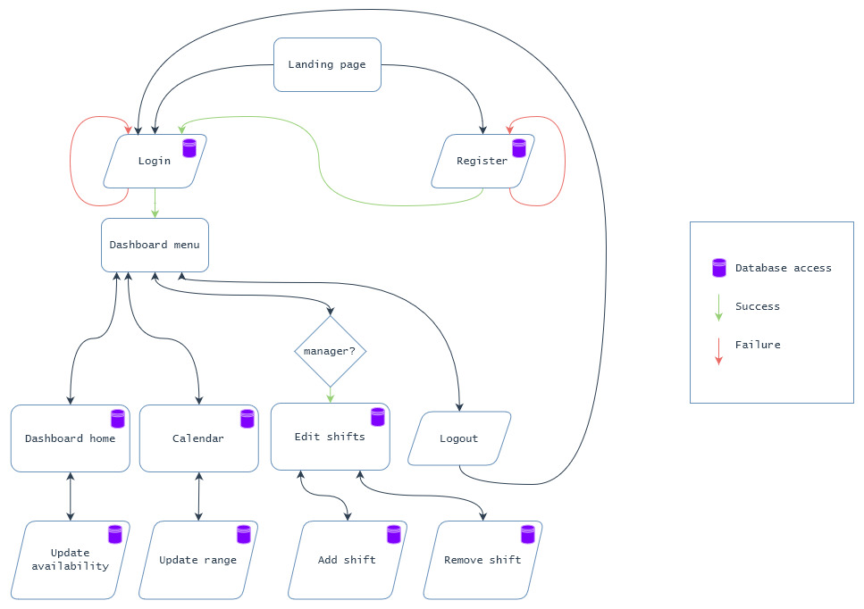
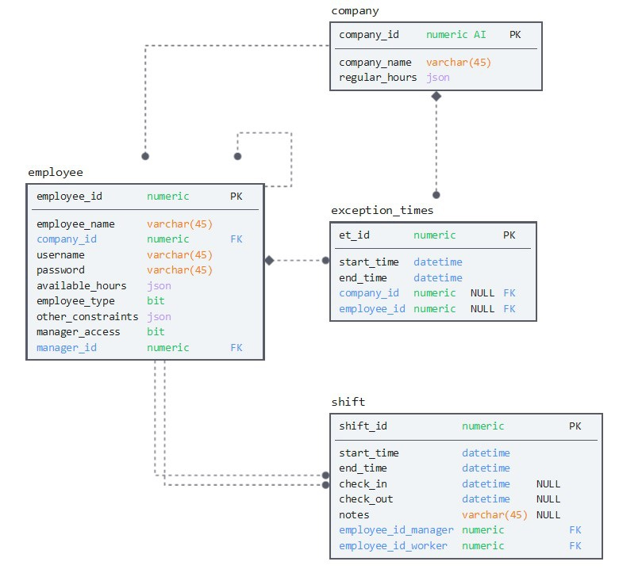

# EasyShift Final Report
Final report for CSCI 483. Written by Travis MacDonald and Prahar Ijner.

## Introduction

Task scheduling is a process that occurs in most companies on a regular basis. For businesses that employ both part-time and full-time workers, a good schedule can result in better employee satisfaction, customer satisfaction, and minimize company costs. However, manually producing and maintaining physical schedules is a needlessly difficult process that can be simplified using software. For this reason, we aim to create a software solution that automates and facilitates the scheduling process. 

## Background

Though the scheduling process may appear trivial upon first glance, a closer look should reveal its laborious nature. Consider how this might look for a small grocery store.

The first step in creating a schedule is to consider all of the parameters involved. There are global parameters that apply to all employees (e.g. regular hours of operation), recurrent parameters that apply to individual employees (e.g. some employee is unavailable on Wednesday evenings), and single-occurrence parameters that apply to individuals (e.g. some employee is unavailable on February 1st).

It's important to note that parameters also vary in nature. There are strict parameters that must be upheld, and there are soft parameters that are not necessarily satisfiable. Regular hours of operation, for example, are strict because employees are guaranteed to not work outside of these hours. Requested time off however, is a soft parameter because it cannot be guaranteed. For example, if all employees request the same day off, but the store requires that at least one employee be present, then some employee's request cannot be fulfilled.

Once the parameters are in place, the second step is to actually develop the schedule. There are many approaches to do this manually: develop a schedule one employee at a time, or perhaps develop a schedule one day at a time. Regardless of the method, it's important to note that conflicts will arise and revisions must be made; it's an iterative process. It's also worth noting that the resulting schedule may contain errors (e.g. scheduling an employee during their vacation).

The third -- and perhaps most important step -- is the maintenance of the schedule. Of course plans change, and employees may request time off after a schedule has been posted. Unfortunately, a single change might cascade into further conflicts, requiring more time and effort from the scheduler. Likewise, changing an already posted schedule requires that the manager notifies all employees involved so that they are up-to-date with the latest schedule.

All in all there is a needless amount of overhead for an intuitively simple task.

Our aim is to create a software scheduling solution that overcomes the main downfalls mentioned above. EasyShift will allow all employees to operate on a shared schedule with position-based access control. We also plan to have future implementations include a feature where schedules can be automatically generated based on given parameters.

EasyShift will address the parameter organization problem by implementing transparent communication. With manual scheduling, managers might forget about an employee's requested time off. With EasyShift, all parameters are visible on the schedule (e.g. requested time off appears greyed out on the timeline), meaning that the manager isn't tasked with manually maintaining all of the latest parameters. Ultimately, this reduces errors when making schedules.

The issue of schedule generation can be solved through the use of scheduling algorithms. Such algorithms have been implemented in operating systems for over 20 years, and although they can't automatically create schedules, they can surely be modified to carry-out this task. This means managers do not have to spend as much time making schedules, therefore reducing company costs.

Finally EasyShift aims to minimize the difficulty of schedule maintenance. It's clear that revising digital data is much easier than its physical counterpart. On top of this, changes to the schedule could also trigger notifications to all employees involved, meaning that managers are not required to manually contact all employees after a change is made. This ensures that employees are always up-to-date with the latest version of the schedule.

## Additional efforts by authors
In addition to concepts covered in the course, we researched and implemented the following to enhance the functionality and usability of EasyShift.

- Database implementation and connection
- Error handling
- Cascading style sheet
- Container management
- UI Components
  - DatePicker
  - Timeline
  - Card
  - Dialog
  - TabMenu
  - Ajax - partial rendering and processing

## Website design and workflow

### Home page (landing page)

The home page is the first page the user sees. There isn't any particularity interesting functionality here. Rather it acts as a simple entrance to the website whereby users can either login or register. The UI is consistent with the application's color theme.

The only real functionality on this page is the navigation. Users can navigate to the login and register pages by either using the home page buttons, or the PrimeFaces' `<p:tabMenu>` bar at the top. It's worth noting that these three pages share xhtml code for this component code through the `<ui:include>` tag.

### Login page

The login page is responsible for sending users to the core scheduling functionality. The UI components on this page are pretty simple, consisting mainly of `commandButton`s, `inputText`s, and `password`s. The input fields contain floating placeholders that are provided from PrimeFaces by using the class `ui-float-label`. Basically the placeholder (e.g. "Username") is located inside the component until the user interacts with it, where it then *floats* above the component.

The functionality from this page uses database queries for user verification. When the user clicks the login button, the system will either verify them and navigate to the dashboard page, or show them an error and keep them on the login page. The only successful verification case is when the username exists in the database, and the password matches the one in the database. If either of these conditions fails (including the user leaving the fields blank), then the user is kept on the login page and an error message is shown (e.g. "Incorrect Password").

### Registration page

The registration page is similar to the login page with a bit of added complexity. On this page, users are required to enter their email, username, and a password (with a confirmation copy). 

A registration attempt is successful when all of the following conditions hold: the username doesn't already exist in the database; the email doesn't already exist in the database; both passwords match; the email address is valid (i.e. regex that verifies a name and domain, with an '@' symbol as a partitioning character). 

When a registration is successful the user is navigated to the login page and their credentials are added to the database. Similar to the login page, an invalid registration results in the user staying on the page with an error message.

### Dashboard-menu
The dashboard menu is the top bar seen by the user upon login. This consists of navigation links for the pages `dashboard.xhtml`, `calendar.xhtml`, `edit_events.xhtml`, and a logout button. The dashboard menu is defined as a template using the `ui:composition` from JSF-Facelets and included into each of the pages the user interacts with after logging in.
The dashboard's edit events button is a conditionally rendered element that is displayed only when the logged in user has manager level access. Figure 2 and 3 show the rendered dashboard menu for users who are managers and those who are not.

*XHTML source*: `project/src/main/webapp/template/dashMenu.xhtml`

{ width=50% style="margin: auto;" }

{ width=50% style="margin: auto;" }

### Dashboard home
The dashboard home is the first page the user sees after successfully logging into EasyShift. This interface displays the user's current company and the ID of their manager.

Additionally, the dashboard home displays the current availability of the user for each day of the week. The user is has the ability to add or remove availability on any of the days and submit these changes to the system. The interface to facilitate the update of availability uses the components `p:dataTable`, `p:datePicker`, and `p:commandButton`, some of which are conditionally rendered and conditionally editable. The system to edit availability is build with the following features.

- **Add or remove availability on any day** : The user can indicate their abailability on any day of the week by setting hours when they are willing to be scheduled. This can include night shifts, part time abailability, and unabailability on any day(s).
- **Add multiple availabilities on a single day** : It is quite common for part-time workers to have multiple abailabilities in a given day, between which they have other engagements. The multiple abailability feature allows them to indicate all these times for easier and more efficient scheduling by the manager.
- **Changes stay local until they are submitted** : In order to avoid un-necessary update events on the database in cases where the user erroneously updated their availability, the changes are not submitted to the database until the user clicks the submit changes button.

*XHTML source*: `project/src/main/webapp/dashboard.xhtml`

### Dashboard calendar
The dashboard calendar shows the availability and shifts scheduled for all the employees in the current user's company. By default, the calendar loads the availabilities and shifts for 7 days from the time of loading the page. The default 7 day range facilitates low resource usage while showing the most immidietely needed information. The user is able to change the range by updating the from and to dates above the timeline that displays the events.

The main componenets of the dashboard interface are `p:timeline`, `p:commandButton`, and `p:datePicker`. It should be noted that the `p:timeline` component uses the server's timezone as the default timezone. While using this with docker containers, this may display the times in UTC (depending on how the image is initialized). In order to avoid confusion, the default time-zone has been set to *America/Anguilla* to correspond to ADT.

*XHTML source*: `project/src/main/webapp/calendar.xhtml`

### Dashboard edit-events
The dashboard edit-events page is exclusively available to users who are managers. This is to ensure that users without appropriate authorization are not able to add or delete shifts. The page can be visited using the *Edit shifts* tab in the dashboard menu. The layout of this page is identical to dashboard calendar with the exception of two additional buttons: *Add shift* and *Remove shift*.

- **Add shift** : Clicking on the *Add shift* button opens up a `p:dialog` with a `p:selectOneMenu` to select the name of the employee that is to be scheduled. The dialog box consists of two `p:datePicker` elements to select the start and end date and time for the shift to be added. Additionally, the scheduling manager can add notes to the shift for the employee. The shift is submitted by clicking the *Add* button at the bottom of the dialog. 
 
- **Remove shift** : Clicking the *Remove shift* button opens another `p:dialog` with a `p:dataTable` that consists of all the shifts within the *From* and *To* range on the edit shifts page. The user can delete shift(s) by clicking the delete button on the row corresponding to the shift. 

*XHTML source*: `project/src/main/webapp/edit_shifts.xhtml`

### Logout
The logout tab in the dashboard menu allows the user to log out of their account. Since all the user's activity after logging in is scoped within a session, the logout is performed by ending the session and re-directing the user to the login page.

### Styling
To ensure consistent design patterns and colors throughout the web pages, we defined a style sheet (see `project/src/main/webapp/styles.css`). This tool significantly aided us in improving the visual appeal of the application and setting parameters to distinguish calendar events, i.e., available and scheduled events.

### Database
A database is a critical part of any web application. For EasyShift, we use a database to store all information about employees, companies, and shifts. The database server used is MySQL 8.0. The database schema used is defined in the figure below. It should be noted that the schema contains the table `exception_times` which is a feature not used in the current implementation, but is intended to indicate vacation days or sick days for an employee or a company.

{width=70% style="margin: auto;"}

## Future steps

Our approach to building EasyShift is to start with the core functionality and expand outward from there. Technically speaking, the timeline is the basis for our project; every feature aims to enhance its serviceability.

For core functionality, we have implemented a timeline that is intractable: managers can edit, remove and add shifts, and users can view and edit their respective availability. We also have user verification and registration, that is, users can create and access their own scheduling information.. 

For next steps we plan to implement the ability to users to create and edit companies. This would allow managers of a store (e.g. Sobey's bakery) to create a schedule for their department. Ideally this means they could choose which employees could access the schedule.

Later on, we believe a parameter based schedule generator is a great feature for a lot of companies. This would allow managers to create schedules with a click of a button. This feature could also include some sort of metric that shows the number of parameters that could not be satisfied, as well as generate multiple schedules and let the manager pick the best one.

Some other ideal features include a payroll system that tracks actual worked hours; a notification system that notifies all employees of changes that affects them; and a remote database so all employees are operating on the same instance.