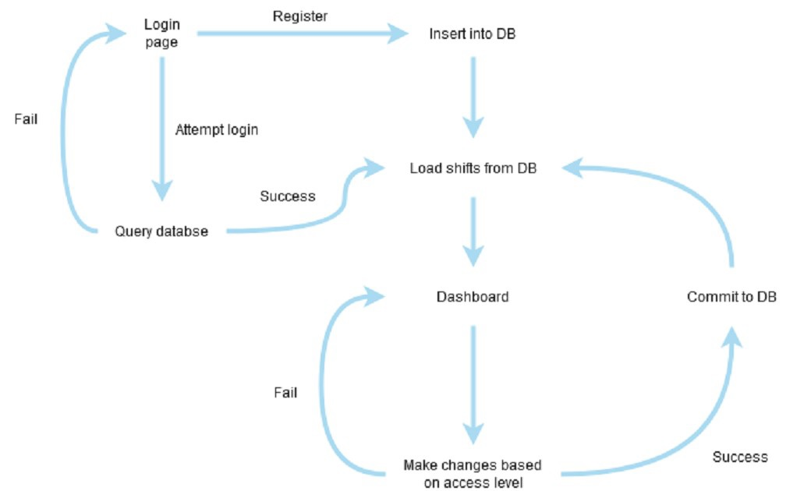
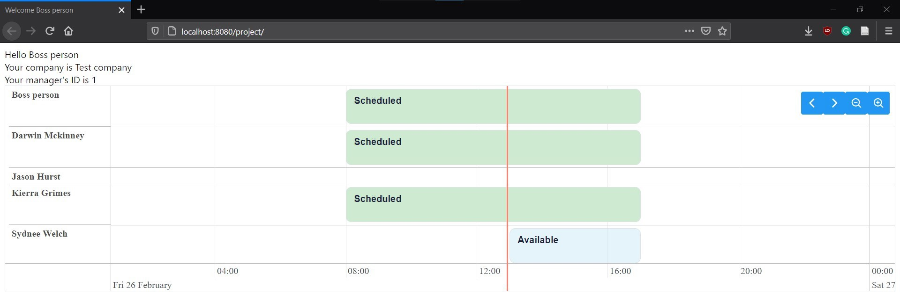

# EasyShift Midterm Report
Midterm report for CSCI 483. Written by Travis MacDonald and Prahar Ijner.

## Introduction

Task scheduling is a process that occurs in most companies on a regular basis. For businesses that employ both part-time and full-time workers, a good schedule can result in better employee satisfaction, customer satisfaction, and minimize company costs. However, manually producing and maintaining physical schedules is a needlessly difficult process that can be simplified using software. For this reason, we aim to create a software solution that automates and facilitates the scheduling process. 

### Background

Though the scheduling process may appear trivial upon first glance, a closer look should reveal its laborious nature. Consider how this might look for a small grocery store.

The first step in creating a schedule is to consider all of the parameters involved. There are global parameters that apply to all employees (e.g. regular hours of operation), recurrent parameters that apply to individual employees (e.g. some employee is unavailable on Wednesday evenings), and single-occurrence parameters that apply to individuals (e.g. some employee is unavailable on February 1st).

It's important to note that parameters also vary in nature. There are strict parameters that must be upheld, and there are soft parameters that are not necessarily satisfiable. Regular hours of operation, for example, are strict because employees are guaranteed to not work outside of these hours. Requested time off however, is a soft parameter because it cannot be guaranteed. For example, if all employees request the same day off, but the store requires that at least one employee be present, then some employee's request cannot be fulfilled.

Once the parameters are in place, the second step is to actually develop the schedule. There are many approaches to do this manually: develop a schedule one employee at a time, or perhaps develop a schedule one day at a time. Regardless of the method, it's important to note that conflicts will arise and revisions must be made; it's an iterative process. It's also worth noting that the resulting schedule may contain errors (e.g. scheduling an employee during their vacation).

The third -- and perhaps most important step -- is the maintenance of the schedule. Of course plans change, and employees may request time off after a schedule has been posted. Unfortunately, a single change might cascade into further conflicts, requiring more time and effort from the scheduler. Likewise, changing an already posted schedule requires that the manager notifies all employees involved so that they are up-to-date with the latest schedule.

All in all there is a needless amount of overhead for an intuitively simple task.

### EasyShift

Our aim is to create a software scheduling solution that overcomes the main downfalls mentioned above. EasyShift will allow all employees to operate on a shared schedule with position-based access control. We also plan to have future implementations include a feature where schedules can be automatically generated based on given parameters.

EasyShift will address the parameter organization problem by implementing transparent communication. With manual scheduling, managers might forget about an employee's requested time off. With EasyShift, all parameters are visible on the schedule (e.g. requested time off appears greyed out on the timeline), meaning that the manager isn't tasked with manually maintaining all of the latest parameters. Ultimately, this reduces errors when making schedules.

The issue of schedule generation can be solved through the use of scheduling algorithms. Such algorithms have been implemented in operating systems for over 20 years, and although they can't automatically create schedules, they can surely be modified to carry-out this task. This means managers do not have to spend as much time making schedules, therefore reducing company costs.

Finally EasyShift aims to minimize the difficulty of schedule maintenance. It's clear that revising digital data is much easier than its physical counterpart. On top of this, changes to the schedule could also trigger notifications to all employees involved, meaning that managers are not required to manually contact all employees after a change is made. This ensures that employees are always up-to-date with the latest version of the schedule.

## Website Design
The EasyShift web application is being developed on JDK 11 and Java EE 8.0 API on the JSF framework. A major component of this project involves user interaction, which is facilitated by \href{https://www.primefaces.org/showcase/index.xhtml?jfwid=e6cde}{PrimeFaces}. For our project, we have chosen PrimeFaces 10.0.0-rc1, which is available via the Maven Central repository. It is an extension of the last stable release of PrimeFaces 8.0 and fully compatible with it. The extension offers better user interaction and more modern-looking elements for the webpage.
The application currently runs on the \href{https://www.payara.fish/products/payara-server/}{Payara 5.201} application server and uses \href{https://www.mysql.com/products/enterprise/database/}{MySQL 8.0} as the database.

### Workflow
The workflow shows the sequence of events that will be processed by the current implementation based on user interaction. It should be noted that the workflow is minimal and does not include all the planned features for the project. Moreover, some aspects of the workflow (registration and updating database) are in the testing phase and have not been pushed to the repository.

The current state of the website includes a login page and a dashboard. The login page is where the user lands when the web app is launched. It is where existing users can log in, and on successful login, it takes them to their dashboard. If login fails, the login page is re-loaded.

{width=70% style="margin: auto;"}

### Login page
The login page consists of a panel that includes a text field to receive the username, and a password field to receive
the password. The submit button is implemented using a command button. When clicked, it establishes a connection with the database and queries it to check if the username and password match any record in the employee table of the database. If a match is found, the user is led to the dashboard page.

{width=50% style="margin: auto;"}

### Dashboard
The dashboard is the first page the user will see after a successful login. It displays the account holder’s name, company, and their manager’s ID, however, more details will be added as the project progresses. By default, it queries the database for shifts and availability of the entire team for 7 days from the current date. This is so that the response time is not very long, and the memory usage is kept to a minimum while ensuring sufficient details are loaded. The shifts and availability are displayed using a custom timeline widget from PrimeFaces.

The widget has been customized using a style sheet for a better visual presentation and distinguishing between availability and scheduled events on the timeline. The timeline is also customized to zoom into the events of the current day as we found it was more convenient to view current events and the time markers are more specific at this zoom level. The can view the other loaded shifts using the arrow buttons at the top right corner of the timeline widget. The future iteration of this will involve querying the database for shifts and availability when the arrows are clicked.

{width=100% style="margin: auto;"}

### Database
For this web application, we will be using MySQL 8.0 as the host server for our database to store information about employees, companies, and shifts. The current schema of the database is shown below. The database is connected to the web application using JDBC, available as a part of the MySQL package for Java (see DBConnector.java for implementation). The current version of the application established an insecure connection to the database, but the future version of the project is planned to establish SSL connection with server certificate validation. It

should be noted that regardless of the SSL unavailability, the passwords are still stored with SHA224 encryption. 

The employee table stores details about the user like their name, username, password, hours they are available to work (available_hours), any other constraints or conditions they have, whether or not they have manager level access, and who their manager is, and other administrative details.

The company table stores the name of the company and the operating hours.

The exception times table is exclusively to hold days employees or companies are not operating. This is to store
one-time events only and not occurrences like an employee is not available every Friday.

Finally, the shift table holds the shifts scheduled at a company for an employee. We have included an option for
check in time and check out time which can be used with the planned payroll system. The manager can also leave
notes for an employee for a given shift. For example: the shipment is coming in at 4 pm instead of 5 pm.

{width=70% style="margin: auto;"}

## Conclusion and Discussion

Our approach to building EasyShift is to start with the core functionality and expand outward from there. Technically speaking, the timeline is the basis for our project; every feature aims to enhance its serviceability.

For core functionality, we implemented a timeline with mock data using a local database. As a starting point, the calender is read-only, so interacting with the calendar does not alter the underlying data source.

For next steps we plan to setup a landing page that provides users with an overview of what our software offers. Alongside this we also plan to polish up our login page, add a sign-up feature, and implement a more robust user verification workflow.

Alongside this, we plan to make the calendar intractable. This means that users with privileged access (i.e. managers), will be able to make modifications to the schedule that trigger updates to the database. Of course, this feature entails that we modify our system to provide different functionalities and views to employees and managers.

Though the tasks layed out involve a large amount of effort, it is worth considering what this product should include in a real-world setting. 

We believe a parameter based schedule generator is a great feature for a lot of companies. This would allow managers to create schedules with a click of a button. This feature could also include some sort of metric that shows the number of parameters that could not be satisfied, as well as generate multiple schedules and let the manager pick the best one.

Some other ideal features include a payroll system that tracks actual worked hours; a notification system that notifies all employees of changes that affects them; and a remote database so all employees are operating on the same instance.
